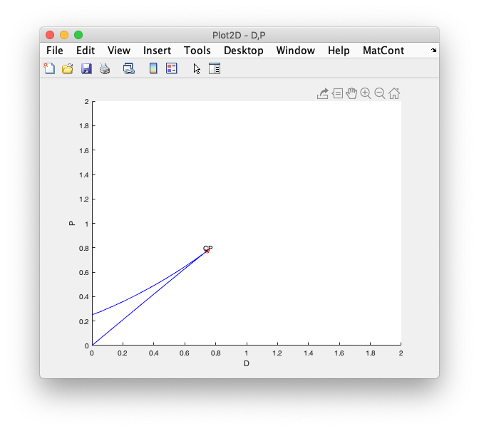

The least user-unfriendly of the bifurcation packages seems to be **matcont**, which is an implementation within Matlab. It can be downloaded from https://sourceforge.net/projects/matcont/. It should be unpacked into a folder in a user directory, as we will need to do the computation *within* the matcont directory (there might be some way to add it to matlab's search path, but the standard practice with matlab seems to be to mix user code and downloaded code all in the same place---one of the reasons matlab is not open-science-friendly).

There's a user manual that is not helpful to beginners (pdf version available at http://www.staff.science.uu.nl/~kouzn101/NBA/ManualJan2018.pdf). A somewhat more useful tutorial is at http://wwwhome.math.utwente.nl/~meijerhge/MT_JR_slow.pdf. In particular, I learned a lot by working through the example in section 3 (skipping the step of entering the rather complex model; it already exists---named "JR_slow" and can be loaded using **Select > System > Load/Edit/Delete Systems** in the *Matcont GUI* window). One thing I found is that the menu commands in the tutorial were not exactly as described in the manual, but I was able to find all of them eventually. Perhaps on Windows there is a better correspondence, in which case you should use the tutorial as a guide rather than my comments below.

You'll also need to have Matlab installed. If you don't already have it, you can get it from https://www.mathworks.com/academia/tah-portal/university-california-santa-barbara-40469638.html. You'll need to log in with your UCSB NetID, and then create (if you don't already have one) a matlab account as well; this is what you'll need at the end of the installation process to verify your license. If away from UCSB you might need to go through the proxy server; but perhaps the UCSB netid overcomes that.

So... start up Matlab, and navigate to the MatCont7p1 folder (the last three letters may differ if you ended up with a different version of matcont). Type `matcont` in the command window, which pops up one or more windows.. I got one warning message in the console that I ignored.

# Type II model
We start with the model that we've already analyzed. Create a new system using (*Matcont GUI*):**Select | System | New** (I'm using the same menu notation as the tutorial---see p. 3). Fill it out as follows:

Hit "OK".

## Simulate the model to find an equilibrium numerically

Click (*Matcont GUI*):**Type|Initial point|Point** to initialize the computation of a trajectory starting from a point. We want to be sure of finding the nontrivial equilibrium, so in the *Starter* window set $P < D < 1$ and a positive value for N. I used $N = 1$, $P = 0.5$, and $D = 0.6$.

To get graphical output, click (*Matcont GUI*):**Window/Output|Graphic|2Dplot**. This opens a *Plot2D* window and (perhaps) a *Layout* window. If the latter does not appear, open it using (*Plot2D*):**MatCont|Layout**. Put "Time" on the abcissa and "Coordinates" on the ordinate. Set time to range from 0 to 15:

Hit OK (if you leave this window open then other menus don't work properly).

In the *Integrator* window set "Interval" to 15. Then click  (*Matcont GUI*):**Compute|Forward**. It looks pretty close to convergence:

## Continuation of the equilibrium
We now "continue" the equilibrium to see how its value and stability vary as we change one of the parameters. 

First, click "View Result" in the *Control* window (if you've already closed that window, re-run the forward computation). Transfer the final value of N to the *Starter* window by double-clicking on "Last Point" in the *Data Browser*. Set the analysis type using (*Matcont GUI*):**Type|Initial point|Equilibrium**. Click the radio button next to P.

In the Plot2D window, change the layout to put Parameter P on the Abcissa:

Get rid of the old curve with (*Plot2D*):**MatCont|Clear**
Then click  (*Matcont GUI*):**Compute|Forward**. Counterintuitively, this follows *decreasing* values of P, tracing the equilibrium back to zero:

Now for the interesting bit. Click (*Matcont GUI*):**Compute|Backward**. When the *Control* says "Paused, Limit point", hit "Resume". Do it again at the "branch point":

Click "View Result" in *Control* to see the values at the two bifurcations.

Finally, add the zero equilibrium by setting N to zero in *Starter* and again computing forward and backward (you may want to hit "Stop" once it gets beyond the range of the graph; I'm not sure how far it will go):

Thus we see that BP ("Branching Point") is what we have been calling the transcritical bifurcation, and LP ("Limit Point") is the saddle-node bifurcation.

## Getting data and information out
From a particular curve's "View result" window, we can do two useful things:

1. Click the "View CurveData" button. This allows us to see the eigenvalue at each point on the curve---recall for that this one-dimensional model, negative eigenvalues represent stable equilibria and positive eigenvalues represent unstable equilibria.
2. Click the "Export" button to export all of the curve's data to a Matlab object accessible from the console. From there, with a little bit of work, it should be possible to export a csv file that allows plotting with a different program (such as R).

Note that, when in the *Data Browser* window, we can get to other previously calculated quantities by clicking on the buttons on the top of the window. For example, clicking on "Diagram; diagram" shows a list of all the previously calculated curves; double-clicking one of those takes us to the details of that curve, from which we can, for instance, send a data point to the *Starter* or examine and export the curve data as above.

From here we can also rename (which may be helpful!) and delete individual curves (e.g., if we end up running the same curve twice).

Going up another level (to "System") only seems to give one option "diagram"; I'm not sure what is going on here.

## Continuation of the bifurcation through $P$--$D$ space
Get back to the results screen that shows the LP and BP of the non-trivial equilibrium (this might require re-running some of the previous analysis---I haven't yet worked out how to reload a curve after moving on). Double-click the LP value to load it into the *Starter*. Also in the *Starter*, select the radio button for D.

Select (*Matcont GUI*):**Type|Initial point|Limit Point**. Create a new 2D plotting window, and set the axes to be P and D; I set the limits to range from 0 to 2.

(*Matcont GUI*):**Compute|Forward** shows the bifurcation curve running towards smaller values of P and D; stop it when it goes off the edge of the graph. Computing backwards goes in the opposite direction, but it gets stuck as it approaches the pitchfork bifurcation at (1, 1).

This can be overcome by increasing the "MinStepsize" in *Continuer*. Setting it to 0.01 seems to work well; it then reaches a "CP" (cusp point) at (1,1) and then gives the option to continue; the resulting curve looks like this:

Now we can try to add the transcritical bifurcation curve. In the *Data Browser*, find the curve that corresponds to the trivial equibrium going through the BP, open that, select the BP, and double-click to send it to the *Starter*.

Select (*Matcont GUI*):**Type|Initial point|Branch point**. In the *Starter*, ensure that the radio buttons are selected for both P and D.

Whoops! It appears that the software doesn't allow a Branch Point to be continued across two parameter values!?!?!?

# Type III model
The model is given by
\begin{equation}
\frac{dN}{dt}=N\left(1-N\right)-P\frac{N^{q+1}}{N^{q+1}+D^{q+1}}.
\end{equation}

Differentiating the RHS with respect to $N$ and evaluating at $N=0$ reveals that the trivial equilibrium is always unstable if $q>0$. Yet, when $q$ is close to zero, the dynamics should be similar to the type-II model.

We set up the model in MatCont as `OwlVole_III`, set $P = 0.5$, $D = 0.6$, and $q = 0.01$. We find the largest equilibrium by integrating from an initial $N = 1$, and then continue the equilibrium through values of $P$. The result is as follows:

So instead of intersecting the zero equilibrium and creating a transcritical bifurcation, there is a second SN bifurcation, and for values of $P$ to the right of that bifurcation there is a stable equilibrium that's just a little bit larger than zero. For values of $P$ between the two SN bifurcations, there are two stable equilibria, just like there are for the type II model between the TC and SN bifurcations.

We can now continue both of these bifurcations in $N$--$P$ space:

The cusp is where the two LP's intersect; between the two curves is the area of bistability. Notice that here, where $q=0.01$, the cusp has moved away from (1,1) (the value for the type-II model).

Below the region of bistability, the only stable equilibrium is "large;" above it (large $P$) it is close to zero. To the right of the cusp, there is no bistability, but the one equilibrium transitions continuously from large to small as $P$ increases. Close to the cusp, that transition can be quite steep; here it is for $D=0.8$:

Presumably, the transition becomes less steep as we move away from the cusp point. We could visualize this by superimposing contours of the equlibrium value on the bifurcation plot.

In principle, we should be able to follow the cusp point through 3-D parameter space. But, just as the GUI would not allow a 2D analysis of the BP, it will not allow a 3D analysis of the CP. Maybe with the command line?

In the meantime, we can make similar plots for different values of $q$. Extrapolating from the two cases visualized so far ($q=0$ and $q=0.01$), it seems that increasing $q$ will shrink the region of bistability (although it's not clear quite how to interpret $D$ here). For a large enough value of $q$ (indicating that the predator strongly prefers alternate prey when N is small), there may be no bistability at all! Then the management question is just how large P needs to be to acheive a desired level of control.

#####################################################
EHH 07/11/19

Varying $0.01<=q<=2$, $N$ seems to stabilize around the same point ($~N=0.59$): 

Using this as the equilibrium $N$, and calculating the equilibrium P for a variety of q's, there are two limit points when $q=0.01$ and when $q=0.02$ for values greater than $q=0.02$, there are no longer limit points:

#####################################################
EHH 08/08/19

It seems that D much be much less than P (by about an order of magnitude) to see areas of bistability. For example, when $P=0.5$ and $D=0.6$, the equilibrium N is 0.584 (where $q=1$) there is no bistable region.

In contrast, when $P=0.5$ and $D=0.05$, there are two limit points ($Neq=0.005$ and $q=1$)

The cusp bifurcation in the P-D parameter space

Increasing q to 3, we find the equilibrium N is much smaller ($Neq=0.02$), but there are still two limit points.

and the cusp point looks similar to q=1

